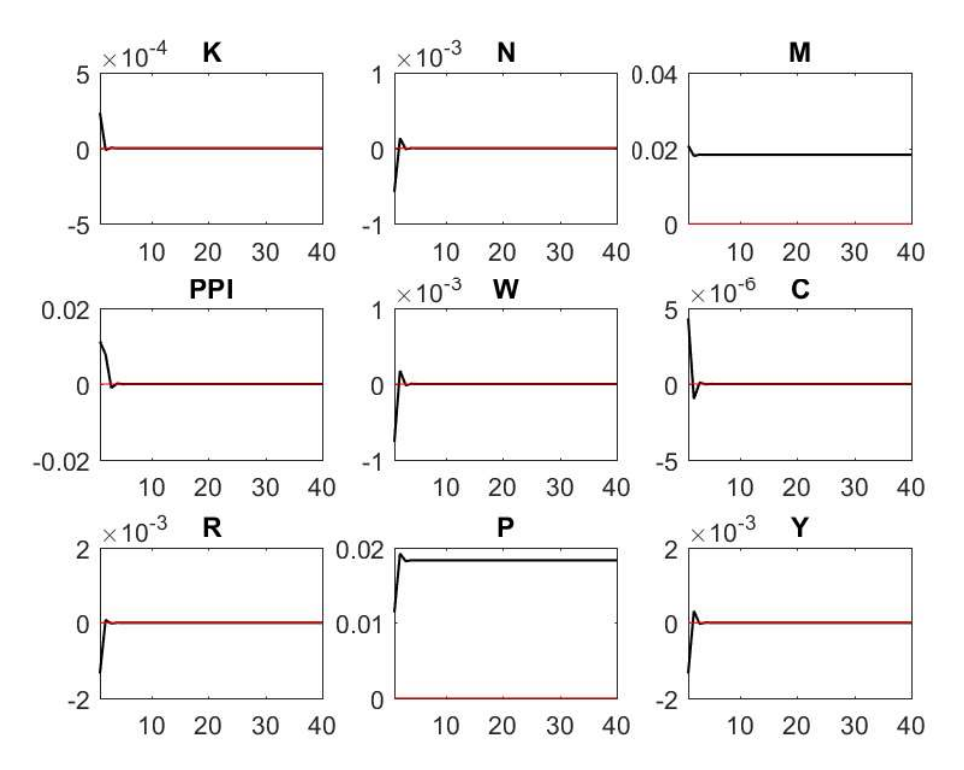
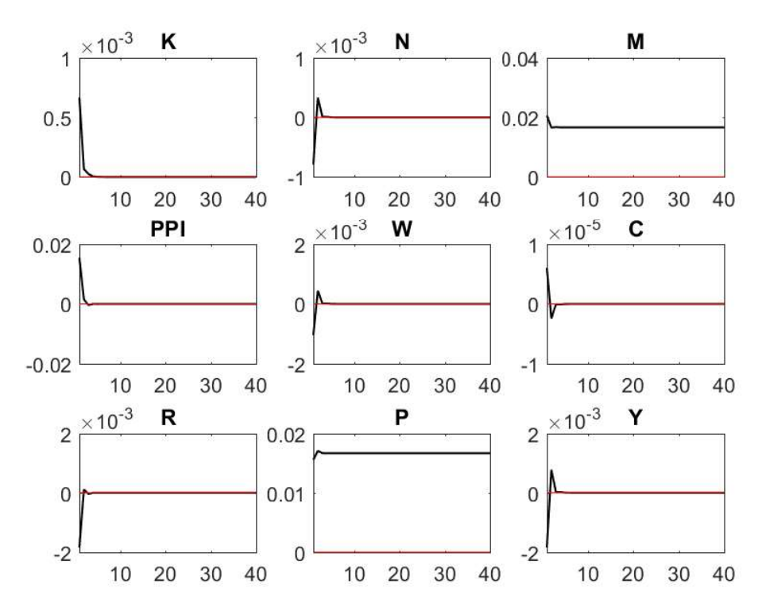

# Speculation, Bank Money Creation, and Output in a DSGE Model

## Overview

This repository contains a calibrated, closed-economy cash-in-advance DSGE
model developed to study how speculative-return shocks can interact with bank
credit allocation, money creation, inflation, and output. The model originates
from my master's thesis and a related research note focused on the Iranian
economy.

The project is presented as a Dynare and structural-macroeconomic modeling
sample. Its results are model-based implications under a particular
calibration; they are not causal estimates or a complete policy evaluation.

## Research Question

How does a positive shock to the return on speculative activity affect bank
money creation, prices, inflation, and output when some bank lending can be
diverted away from productive use?

## Model

The model contains a representative household, productive firms, a banking
sector, and a consolidated fiscal-monetary authority. Households supply labor
and capital and allocate wealth across money, deposits, and bonds. Productive
firms use capital, labor, and real lending. Banks accept demand and time
deposits, extend loans, and operate subject to reserve requirements.

The parameter `qq` represents the share of bank loans allocated to productive
activity. Four calibrated cases are retained:

| Model file | Productive loan share |
| --- | ---: |
| `speculation_money_creation_q02.mod` | 0.2 |
| `speculation_money_creation_q04.mod` | 0.4 |
| `speculation_money_creation_q06.mod` | 0.6 |
| `speculation_money_creation_q08.mod` | 0.8 |

Each case preserves its own historical steady-state calibration. The cases are
therefore provided as separate `.mod` files rather than as a one-line parameter
switch. See [`models/README.md`](models/README.md).

## Shocks and Simulation

The model includes two exogenous innovations:

- `EEPSILONA`: technology shock;
- `EEPSILONIS`: speculative-return shock.

The equations are supplied to Dynare in log-linear form. Each model runs
residual and steady-state checks, verifies local determinacy, fixes the random
seed, and requests first-order stochastic simulation with 40-period impulse
responses and 5,000 simulated periods.

## Repository Structure

```text
speculation-money-creation-dsge-dynare/
├── README.md
├── LICENSE
├── .gitignore
├── models/
│   ├── README.md
│   ├── speculation_money_creation_q02.mod
│   ├── speculation_money_creation_q04.mod
│   ├── speculation_money_creation_q06.mod
│   └── speculation_money_creation_q08.mod
├── replication/
│   └── run_all.m
├── docs/
│   └── speculation_money_creation_research_note.pdf
└── outputs/
    ├── figures/
    │   ├── q02_core_irfs.png
    │   ├── q02_financial_irfs.png
    │   ├── q02_deposit_rate_irf.png
    │   ├── q08_core_irfs.png
    │   ├── q08_financial_irfs.png
    │   └── q08_deposit_rate_irf.png
    └── tables/
        └── historical_irf_summary.csv
```

## Requirements

The model was historically run with:

- Dynare 4.6.4;
- MATLAB R2017a.

Dynare also supports GNU Octave, but this repository package was not
re-executed under Octave or a newer Dynare release. Consult the current
[Dynare documentation](https://www.dynare.org/manual/) for installation and
version-specific guidance.

## Reproduction

Add Dynare to the MATLAB or Octave path, open the repository root, and run:

```matlab
run('replication/run_all.m')
```

To run one calibration only:

```matlab
cd models
dynare speculation_money_creation_q02.mod
```

Dynare-generated working files are excluded by `.gitignore`. The committed
figures are historical outputs recovered from the original project materials;
they were not regenerated in this packaging environment.

## Historical Results

The research note reports that a positive speculative-return shock increases
the monetary aggregate and prices while reducing output. The reported peak
percentage responses are stored in
[`outputs/tables/historical_irf_summary.csv`](outputs/tables/historical_irf_summary.csv).

The reported responses for `q = 0.2`, `0.4`, and `0.6` are numerically
identical, while the `q = 0.8` case differs modestly. This limited sensitivity
is a feature and limitation of the historical calibration; it should not be
interpreted as an empirical estimate of the productive-credit share.

## Selected Historical Output

The following figures show the original 40-period impulse responses to the
speculative-return shock for the two scenarios for which source figures were
available. Variable definitions are listed in
[`models/README.md`](models/README.md).

### Productive loan share: `q = 0.2`



### Productive loan share: `q = 0.8`



## Limitations

- The model is calibrated rather than estimated.
- The economy is closed and omits exchange-rate and external-sector dynamics.
- The banking and fiscal-monetary blocks are stylized.
- The productive-credit share is imposed rather than estimated or endogenous.
- The first three calibration cases produce identical reported percentage
  responses.
- The historical output figures are available only for `q = 0.2` and `q = 0.8`.
- Policy conclusions are conditional on the equations and calibration.

## Skills Demonstrated

- DSGE model construction and log-linear implementation;
- monetary and banking-sector modeling;
- steady-state calibration and sensitivity analysis;
- Dynare diagnostics and stochastic simulation;
- impulse-response interpretation; and
- transparent documentation of model limitations.

## Author

Aliye Nezhad

## License

The code and documentation are released under the MIT License. The research note and historical output figures remain attributable to the author.
